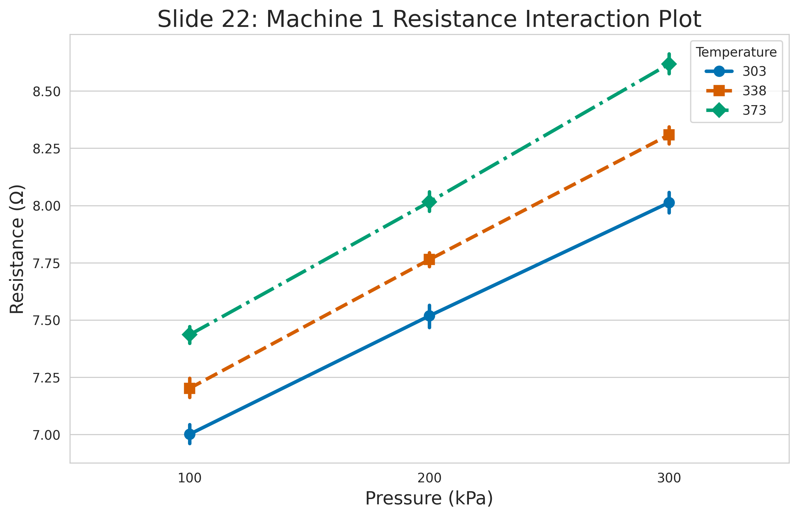

:::: {.columns}
::: {.column width="50%"}

## Sample slides
#### PlaceHolderName
#### Universiti Malaysia Perlis
#### [placeholder@email.com](mailto:placeholder@email.com)

<audio id="bg-music" src="media/audio/sb.m4a" loop></audio>

  Music: “Adrift” by Scott Buckley (CC BY 4.0)

:::

::: {.column width="50%"}

:::

::::

---

:::: {.columns}
::: {.column width="50%"}
### Slide one
**Key Concepts:**
- Energy conservation per @carnot1824.
- $\Delta U = Q - W$
:::

::: {.column width="50%"}

:::
::::

---

---

:::: {.columns}
::: {.column width="50%"}
### The Master Equation
The fundamental relation of thermodynamics:

$$\Delta U = Q - W$$

The work done $W$ is positive when the system expands against an external pressure.
:::

::: {.column width="50%"}
<video data-src="media/videos/sample.mp4" data-autoplay loop muted width="100%"></video>
:::

::::

---

:::: {.columns}
::: {.column width="50%"}
### Visualizing the Gas Law
**Interactive Model:**

- P, V, and T relationships.
- Use the slider to adjust pressure.
- Observe the phase boundary.
:::

::: {.column width="50%"}
<iframe 
  data-src="media/plots/sample.html" 
  width="100%" 
  height="500px" 
  style="border:none;" 
  scrolling="no">
</iframe>
:::
::::

---

:::: {.columns}
::: {.column width="50%"}
### Machine 1 Control Analysis
**Parameters:**
- Pressure: 200kPa | Temp: 338K
- Mean: 49.77
- Spec: [45, 55]

Stability is assessed via the I-Chart generated in the previous step.
:::

::: {.column width="50%"}
<iframe data-src='media/plots/control_m1.html' width='100%' height='500px' style='border:none;'></iframe>
:::
::::

---

:::: {.columns}
::: {.column width="50%"}
### Machine 1 Process Capability
**Statistical Summary:**
- **Calculated Cpk: 1.246**
- **Status: NOT CAPABLE (Cpk < 1.33)**

As defined in [@carnot1824], efficiency depends on environmental constraints and process stability.
:::

::: {.column width="50%"}
<iframe data-src='media/plots/capability_m1.html' width='100%' height='500px' style='border:none;'></iframe>
:::
::::

---

:::: {.columns}
::: {.column width="50%"}
### Machine 2 Control Analysis
**Parameters:**
- Pressure: 200kPa | Temp: 338K
- Mean: 48.73
- Spec: [45, 55]

Stability is assessed via the I-Chart generated in the previous step.
:::

::: {.column width="50%"}
<iframe data-src='media/plots/control_m2.html' width='100%' height='500px' style='border:none;'></iframe>
:::
::::

---

:::: {.columns}
::: {.column width="50%"}
### Machine 2 Process Capability
**Statistical Summary:**
- **Calculated Cpk: 0.902**
- **Status: NOT CAPABLE (Cpk < 1.33)**

As defined in [@carnot1824], efficiency depends on environmental constraints and process stability.
:::

::: {.column width="50%"}
<iframe data-src='media/plots/capability_m2.html' width='100%' height='500px' style='border:none;'></iframe>
:::
::::

---

:::: {.columns}
::: {.column width="50%"}
### Machine 3 Control Analysis
**Parameters:**
- Pressure: 200kPa | Temp: 338K
- Mean: 51.08
- Spec: [45, 55]

Stability is assessed via the I-Chart generated in the previous step.
:::

::: {.column width="50%"}
<iframe data-src='media/plots/control_m3.html' width='100%' height='500px' style='border:none;'></iframe>
:::
::::

---

:::: {.columns}
::: {.column width="50%"}
### Machine 3 Process Capability
**Statistical Summary:**
- **Calculated Cpk: 0.937**
- **Status: NOT CAPABLE (Cpk < 1.33)**

As defined in [@carnot1824], efficiency depends on environmental constraints and process stability.
:::

::: {.column width="50%"}
<iframe data-src='media/plots/capability_m3.html' width='100%' height='500px' style='border:none;'></iframe>
:::
::::

---

:::: {.columns}
::: {.column width="50%"}
### Slide 13: T-Test Visualization (C1)
**Condition 1:**
- Pressure: 100 | Temp: 303
- Comparison: Machine 1 vs 2

The chart shows the Observed T relative to the rejection regions ($\alpha = 0.05$).
:::

::: {.column width="50%"}
<iframe data-src='media/plots/ttest_cond1.html' width='100%' height='500px' style='border:none;'></iframe>
:::
::::

---

### Slide 14: C1 Statistics
**T-Test Results (P=100, T=303):**
- T-Statistic: 9.2289
- P-Value: 0.0000

### Slide 15: C1 Evaluation
**Is there a true difference?**
- **Output: Yes**

---

:::: {.columns}
::: {.column width="50%"}
### Slide 16: T-Test Visualization (C2)
**Condition 2:**
- Pressure: 300 | Temp: 373
- Comparison: Machine 1 vs 2

Distribution analysis comparing operational variances per [@carnot1824].
:::

::: {.column width="50%"}
<iframe data-src='media/plots/ttest_cond2.html' width='100%' height='500px' style='border:none;'></iframe>
:::
::::

---

### Slide 17: C2 Statistics
**T-Test Results (P=300, T=373):**
- T-Statistic: 8.4381
- P-Value: 0.0000

### Slide 18: C2 Evaluation
**Is there a true difference?**
- **Output: Yes**

---

### Slide 19: ANOVA - Pressure (P)
**Machine 1 Resistance Analysis**

- **Factor:** Pressure (P)
- **Pr(>F):** 5.6926e-119
- **Significant:** Yes

---

### Slide 20: ANOVA - Temperature (T)
**Machine 1 Resistance Analysis**

- **Factor:** Temperature (T)
- **Pr(>F):** 2.1533e-67
- **Significant:** Yes

---

### Slide 21: ANOVA - Interaction (P*T)
**Machine 1 Resistance Analysis**

- **Factor:** Pressure * Temperature Interaction
- **Pr(>F):** 3.3179e-03
- **Significant:** Yes

---

:::: {.columns}
::: {.column width="50%"}
### Slide 22: Interaction Plot
**Visualizing P*T Effects**

This plot illustrates how the relationship between Pressure and Resistance changes across different Temperature levels for Machine 1.

As noted in [@carnot1824], interacting variables define the efficiency bounds of the system.
:::

::: {.column width="50%"}

:::
::::

---
# Bibliography

